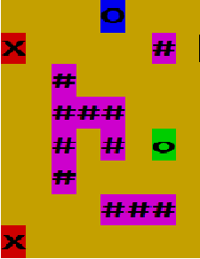

# Console Game & Maven

## Launch

sh build.sh

Remember the good old Java games? In the early 2000s, they were in every phone. Today, Java developers are building scalable enterprise systems, but back then... 

My goal is to get a little nostalgic and implement a game where you run from artificial intelligence entities across a square field. 

**Designations**:  
`o` — position of a player (program user) on the map; 
`#` — obstacle; 
`x` — enemy (artificial intelligence); 
`O` — target point the player must get to before the enemies reach the player. The player is considered to have reached the target cell if they stepped on its position.

**Game rules**:
1. Each participant (player and opponent) may make one move. Then it's another player's turn. The enemy is considered to have reached the player if he can step on the player's position with the current move.
2. Available directions are left, right, down, and up.
3. If an enemy cannot move forward (there are obstacles or other enemies around, or the player has reached the edge of the map), the enemy skips a turn.
4. The target point is an obstacle for an enemy.
5. If the player is unable to move forward (surrounded by obstacles, enemies, or has reached the edge of the map), the player loses the game.
6. The player loses if an enemy finds him before he reaches the target point.
7. The player who starts the game first.

**requirements**:
You can chose any count of enemies, walls, size etc. Chenge this line in build.sh:

`$ java -jar game.jar --enemiesCount=10 --wallsCount=10 --size=30 --profile=production`
